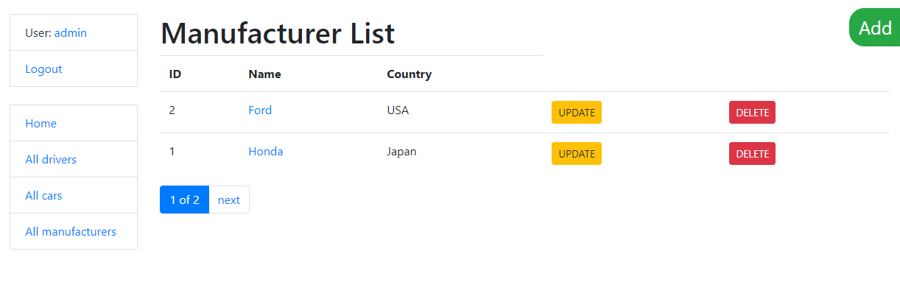

# Taxi Service
Django project to manage a taxi service

## Check it out

[Taxi Service project deployed to Heroku](https://base-taxi.herokuapp.com/)

## Features

* Authentication functionality
* Managing drivers, cars and manufacturers directly
from website interface
* Powerful admin panel for advanced managing

## Installation (for Windows)

Python3 must be already installed

* git clone https://github.com/8Men5Camels/taxi-service.git
* python -m venv venv
* venv\Scripts\activate
* pip install -r requirements.txt
* python manage.py migrate
* python manage.py runserver

## Access

Warning! Please, do not delete any user!

* Username: test
* Password: Test123456

## Demo

